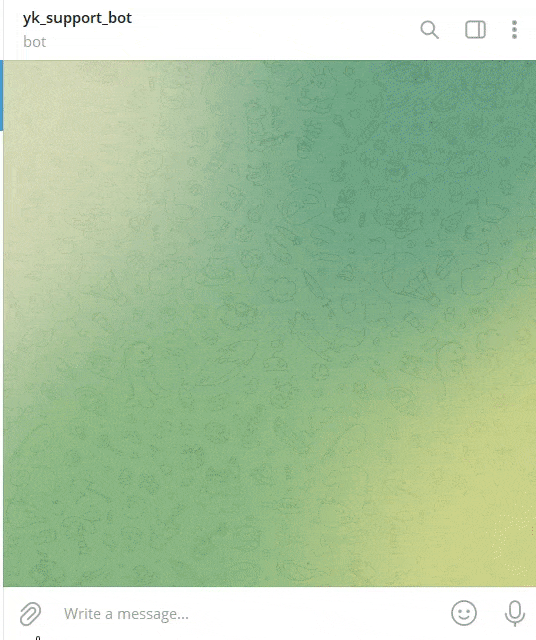
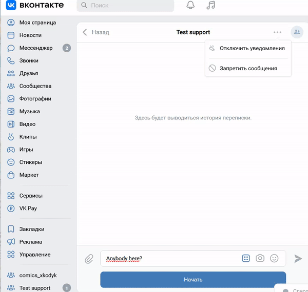

# Publishing house support bots

The project uses the following components:

- "Dialogflow ES agent" provides a natural language understanding (see [Dialogflow ES documentation](https://cloud.google.com/dialogflow/es/docs) for more);
- "Telegram support bot" communicates with [Telegram](https://telegram.org/) users;
- "VK support bot" communicates with [VK](https://vk.com/) users;
- "Logs bot" sends logs messages;

## Demo bots

- "Telegram support bot" demo is [here](https://t.me/yk_ph_support_bot)



- "VK bot" demo is [here](https://vk.com/im?sel=-219274329)



## Prerequisites

Python 3.11 is required.

## Installation

- Download the project files.
- It is recommended to use [venv](https://docs.python.org/3/library/venv.html?highlight=venv#module-venv) for project isolation.
- Set up packages:

```bash
pip install -r requirements.txt
```

- Set up "Dialogflow ES agent" according to [Dialogflow ES documentation](https://cloud.google.com/dialogflow/es/docs);
- Go to [@BotFather](https://t.me/BotFather) and register your "Support bot" and "Logs bot";
- Create your VK group at [vk.com](https://vk.com/)

- **Note**: Bots can't initiate conversations with users. You must send a message to your bot first.

- Set up environmental variables in your operating system or in .env file. The variables are:

  - `SUPPORT_BOT_TOKEN` is your "Support bot" token from [@BotFather](https://t.me/BotFather);
  - `LOGS_BOT_TOKEN` is your "Logs bot" token from [@BotFather](https://t.me/BotFather);
  - `DEBUG_MODE` turns the debug (verbose) mode on or off, optional, default: False (off).
  - `SERVICE_ADMIN_TG_ID` is your token from [@userinfobot](https://telegram.me/userinfobot) in order "Logs bot" can send you log messages;
  - `GOOGLE_CLOUD_PROJECT` is ID of a project that is used by "Dialogflow ES agent";
  - `GOOGLE_APPLICATION_CREDENTIALS` is a path to credentials JSON file (see [GOOGLE_APPLICATION_CREDENTIALS environment variable](https://cloud.google.com/docs/authentication/application-default-credentials#GAC))
  - `QUESTIONS_FILE_PATH` is a path to a JSON file to train "Dialogflow ES agent" (see ["Dialogflow ES agent" training](#dialogflow-es-agent-training))
  - `VK_GROUP_TOKEN` - is a token of your group at [vk.com](https://vk.com/).

To set up variables in .env file, create it in the root directory of the project and fill it up like this:

```bash
SUPPORT_BOT_TOKEN=replace_me
LOGS_BOT_TOKEN=replace_me
DEBUG_MODE=True
SERVICE_ADMIN_TG_ID=replace_me
GOOGLE_CLOUD_PROJECT=replace_me
GOOGLE_APPLICATION_CREDENTIALS=replace_me/application_default_credentials.json
QUESTIONS_FILE_PATH=questions_en.json
VK_GROUP_TOKEN=replace_me
```

## "Dialogflow ES agent" training

You can train "Dialogflow ES agent". Run:

```bash
python learn.py
```

Intents from a JSON file will be added. The examples of "question" files:

- [questions_en.json](questions_en.json)
- [questions_ru.json](questions_ru.json)

The environmental variable `QUESTIONS_FILE_PATH` defines which file will be used.

## Usage

- Start "Telegram support bot":

```bash
python tg_bot.py
```

- Start "VK support bot":

```bash
python vk_bot.py
```

- Go to the bots and send them messages.

## Project goals

The project was created for educational purposes.
It's a lesson for python and web developers at [Devman](https://dvmn.org/).
